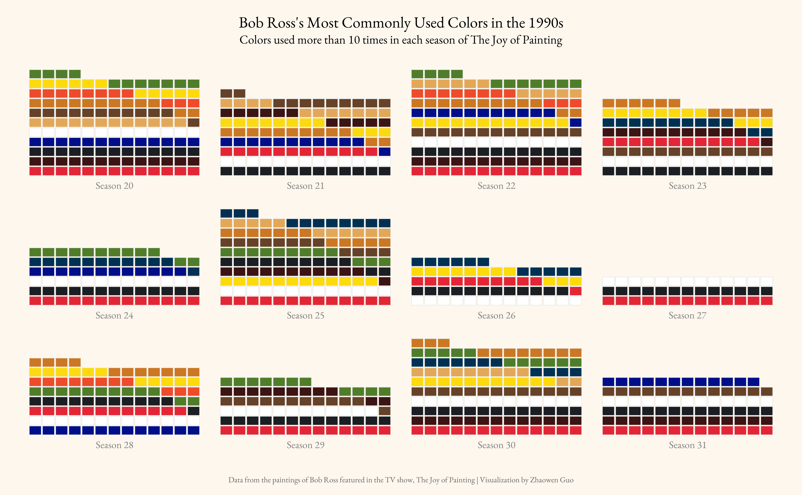
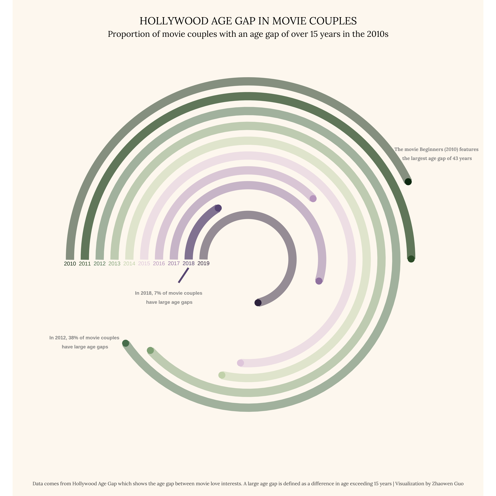
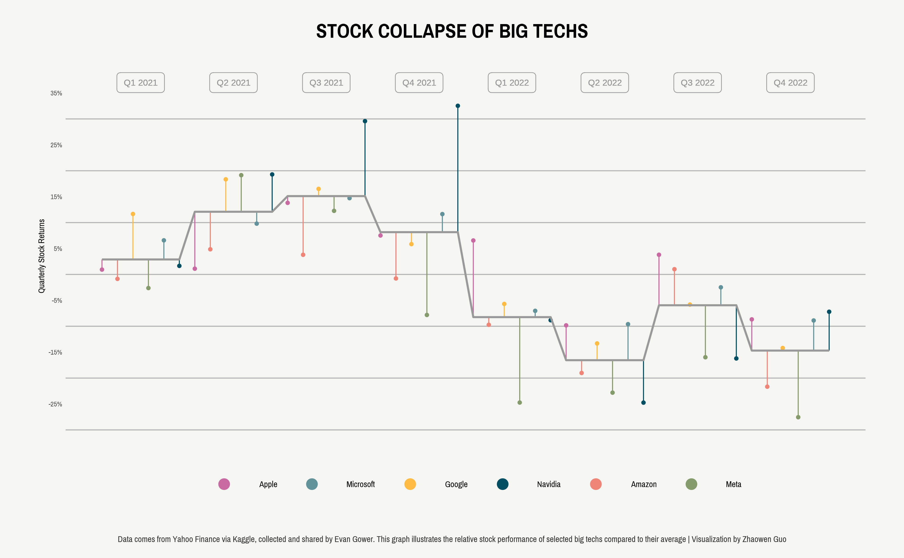

# TidyTuesday
This repository is dedicated to my contributions to the TidyTuesday project. Each contribution is in a separate directory named after the date of the TidyTuesday event, along with a brief description of the analysis I performed. TidyTuesday is a weekly data project aimed at improving skills in data manipulation, visualization and analysis using the R programming language. Each week, a dataset is shared on the [TidyTuesday Github repository](https://github.com/rfordatascience/tidytuesday) and participants are encouraged to share their insights, visualizations and analyses on Twitter using the hashtag #TidyTuesday.

## Gallery of my works

### **[Bob Ross Paintings](2023/0221)**

### **[Hollywood Age Gaps](2023/0214)**

### **[Big Tech Stock Prices](2023/0207)**
